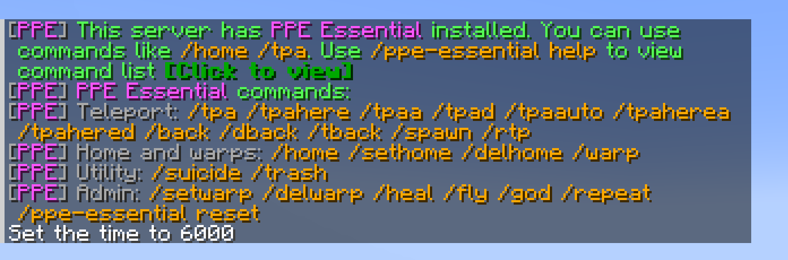

# PPE Essential

PPE Essential is a lightweight server-side mod that adds useful commands (like /home /tpa) and admin controls, with highly configurable options and polished multilingual messages.



## Features

- Server-side only mod, no client installation required.
- No extra dependencies, ready out of the box.
- Polished messages with clickable buttons, titles, and sounds.
- Configurable command toggles, permission levels and more.
- Multilingual support with automatic client language detection and a configurable `fallbackLanguage`.
- Persistent player data for homes, warps, back locations, fly, god mode, and notice triggers.

## Supported Versions

- NeoForge 1.21.1

Fabric support and additional Minecraft versions are in progress.

## Commands

### Teleport

| Command | Description |
| --- | --- |
| `/tpa <player>` | Request to teleport to another player. |
| `/tpaa` | Accept a pending TPA request. |
| `/tpad` | Deny a pending TPA request. |
| `/tpaauto` | Toggle automatic TPA acceptance. |
| `/tpahere <player>` | Request another player to teleport to you. |
| `/tpaherea` | Accept a pending TPAhere request. |
| `/tpahered` | Deny a pending TPAhere request. |
| `/rtp` | Randomly teleport nearby. |
| `/spawn` | Teleport to world spawn. |
| `/back` or `/dback` | Return to your last death location. |
| `/tback` | Return to your previous teleport location. |

### Homes And Warps

| Command | Description |
| --- | --- |
| `/sethome` | Set your home. |
| `/home` | Teleport home. |
| `/delhome` | Delete your home. |
| `/setwarp <name>` | Create a server warp. |
| `/warp <name>` | Teleport to a server warp. |
| `/delwarp <name>` | Delete a server warp. |

### Utility And Admin

| Command | Description |
| --- | --- |
| `/trash` | Open a temporary trash inventory that clears on close. |
| `/suicide` | Kill yourself. |
| `/heal [player]` | Heal yourself or another player. |
| `/fly [player]` | Toggle flight for yourself or another player. |
| `/god [player]` | Toggle god mode for yourself or another player. |
| `/repeat <times> [command]` | Repeat your last command or a specified command. |
| `/ppe-essential help` | Show the command list. Disabled or unavailable commands are shown in red. |
| `/ppe-essential reset all` | Clear all player data. |
| `/ppe-essential reset notice` | Clear notice trigger data. |

Disabled or unavailable commands are shown in red in `/ppe-essential help`.

## Configuration

All configuration options are located in `config/ppe_essential-common.toml`.

## Installation

Put the PPE Essential jar into your `mods` folder.

## Building

```powershell
.\gradlew.bat build --no-daemon
```

Built jars are generated under `build/libs/`.

## License

MIT
